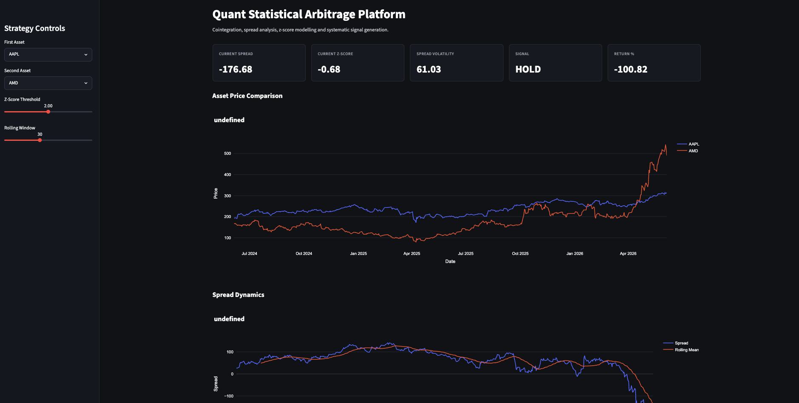
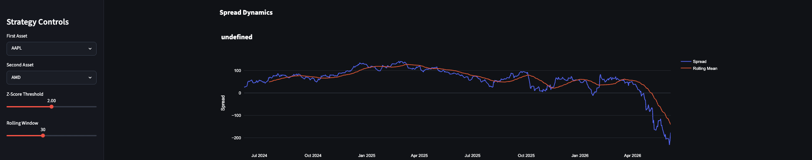
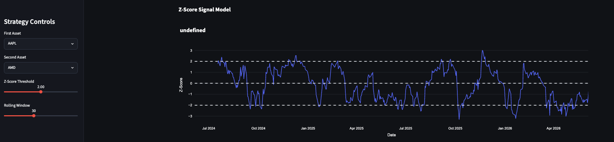
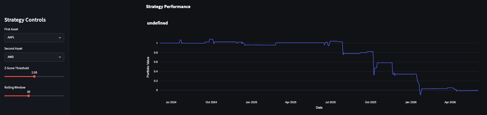
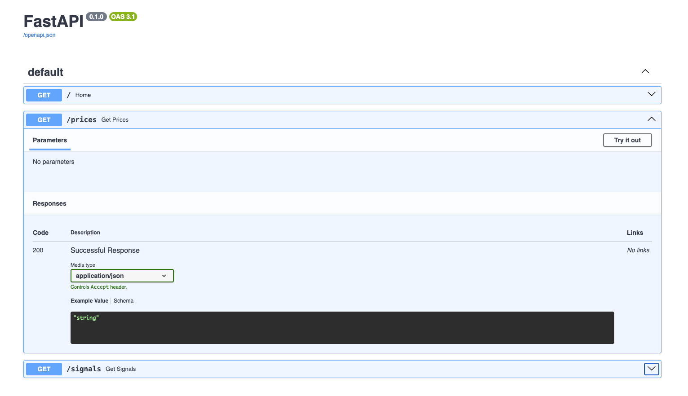

# Quant Statistical Arbitrage Platform

A quantitative trading research platform for statistical arbitrage and pairs trading using cointegration, spread modelling, z-score signal generation and systematic backtesting.

Built using Python, PostgreSQL, FastAPI, Streamlit and Plotly.

---

# Features

* Statistical arbitrage engine
* Cointegration-based pair selection
* Spread modelling
* Z-score signal generation
* Interactive trading dashboard
* Strategy backtesting
* Market data ETL pipelines
* PostgreSQL integration
* REST API endpoints using FastAPI
* Quantitative performance analytics

---

# System Architecture

```text
Market Data
    ↓
PostgreSQL Database
    ↓
ETL Pipelines
    ↓
Cointegration Engine
    ↓
Signal Generation
    ↓
Backtesting Engine
    ↓
FastAPI API Layer
    ↓
Streamlit Dashboard
```

---

# Technologies Used

| Technology  | Purpose                   |
| ----------- | ------------------------- |
| Python      | Quantitative modelling    |
| PostgreSQL  | Market data storage       |
| SQLAlchemy  | Database ORM              |
| Pandas      | Data analysis             |
| NumPy       | Numerical computation     |
| Statsmodels | Cointegration testing     |
| SciPy       | Statistical analysis      |
| Streamlit   | Trading dashboard         |
| Plotly      | Interactive visualization |
| FastAPI     | REST API                  |

---

# Trading Methodology

The strategy identifies statistically cointegrated asset pairs and trades temporary deviations from long-term equilibrium relationships.

## Spread Calculation

```math
Spread = P_1 - P_2
```

## Z-Score Model

```math
z = \frac{x - \mu}{\sigma}
```

Trading signals are generated when the spread deviates significantly from its rolling mean.

---

# Dashboard Features

* Asset price comparison
* Spread dynamics visualization
* Z-score signal engine
* Strategy performance tracking
* Signal distribution analysis
* Trading signal monitoring
* Interactive quantitative analytics

---

# API Documentation

FastAPI Swagger documentation available at:

```text
http://127.0.0.1:8000/docs
```

---

# Installation

## Clone Repository

```bash
git clone https://github.com/YOUR_USERNAME/statistical-arbitrage-platform.git
```

## Create Virtual Environment

```bash
python3 -m venv venv
```

## Activate Environment

```bash
source venv/bin/activate
```

## Install Dependencies

```bash
pip install -r requirements.txt
```

---

# Run Dashboard

```bash
streamlit run dashboard/app.py
```

---

# Run API

```bash
uvicorn api.main:app --reload
```
---

---

# Platform Screenshots

## Dashboard Overview



---

## Spread Dynamics



---

## Z-Score Signal Model



---

## Strategy Performance



---

## FastAPI Documentation



# Author

Nikhil Singh Rathaur
